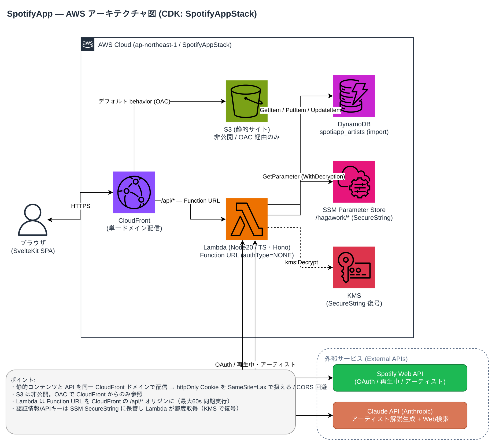

# Spotify Now Playing アプリ（再構築版）

Spotify の「現在再生中の曲」とそのアーティスト解説（生成AI）を表示する Web アプリ。
既存 Flask 版を新スタックで作り直したもの。設計は [`docs/`](./docs/) 参照。

## アーキテクチャ



AWS 構成図。編集可能な元データは [`docs/architecture.drawio`](./docs/architecture.drawio)
（[app.diagrams.net](https://app.diagrams.net) または VS Code 拡張 `hediet.vscode-drawio` で開く）。
図を更新したら PNG を書き出し直す（手順は [`docs/architecture.drawio` の章末メモ / infra/README.md](./infra/README.md) 参照）。

## 構成（モノレポ）

| ディレクトリ | 内容 | 技術 |
| --- | --- | --- |
| [`frontend/`](./frontend) | 静的SPA（ログイン / 再生中画面） | SvelteKit（adapter-static）, marked + DOMPurify |
| [`backend/`](./backend) | API（`/api/*`） | TypeScript / Hono on AWS Lambda |
| [`infra/`](./infra) | IaC | AWS CDK（S3 + CloudFront + Lambda Function URL + Lambda、DynamoDB は import） |
| [`docs/`](./docs) | 設計書 | — |

## 機能

- Spotify OAuth ログイン（リフレッシュトークンを httpOnly Cookie に保持）
- 再生中トラックの取得・表示
- 各アーティストの解説を **Claude（claude-opus-4-8）** で生成し DynamoDB にキャッシュ
- 解説は **Markdown** で描画、再生成も可能

## 開発

```sh
# バックエンド（ローカル、要 AWS 認証情報）
cd backend && npm install && npm run dev      # http://localhost:8888

# フロントエンド（/api は vite proxy で backend へ）
cd frontend && npm install && npm run dev     # http://localhost:5173
```

型チェック: `backend` は `npm run typecheck`、`frontend` は `npm run check`。

## デプロイ

[`infra/README.md`](./infra/README.md) を参照（要プロファイル `hagauser1`）。
概略: `frontend` をビルド → `cdk deploy` → CloudFront ドメイン確定 →
`SPOTIFY_REDIRECT_URI` を SSM 設定 → Spotify ダッシュボードに Redirect URI 登録。

## 既存版との主な差分

Perplexity → Claude、プレーンテキスト → Markdown、Flask 常駐 → サーバレス、
Jinja テンプレート → SvelteKit SPA（S3+CloudFront 配信）。
